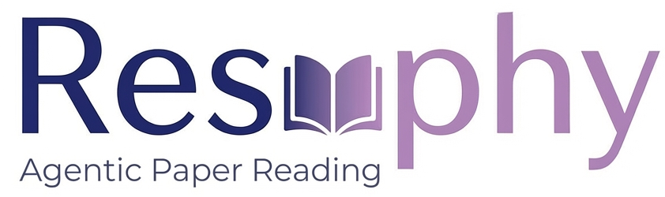

  

## Introduction

In the era of rapid AI development, researchers need a **customizable modern paper reader** to accelerate knowledge acquisition. **Resophy** is a fully open-source, Vibe Coding-oriented modern paper reading and management platform.

- **Vibe Coding Oriented**: All features are implemented through Cursor + Claude Sonnet 4.5, using a simple tech stack (HTML + JavaScript + Python Flask)
- **Easy to Customize**: You can modify the source code anytime via Vibe Coding to add your own features and build your personalized paper reading tool

#### Core Features

- 📚 **Paper Management**: Tree-based categorization, full-text search, metadata management
- 🤖 **AI-Powered PDF Translation**: One-click translation from English to Chinese, generating bilingual side-by-side versions
- 🧠 **AI Analysis Generation**: Deep analysis of paper content, generating structured interpretation reports
- 📰 **Automatic arXiv Paper Fetching**: Scheduled retrieval of latest papers with intelligent filtering to quickly find research you're interested in
- ⚡ **Boost Reading Efficiency**: Combine AI analysis and translation to significantly increase your daily paper reading volume

---- 