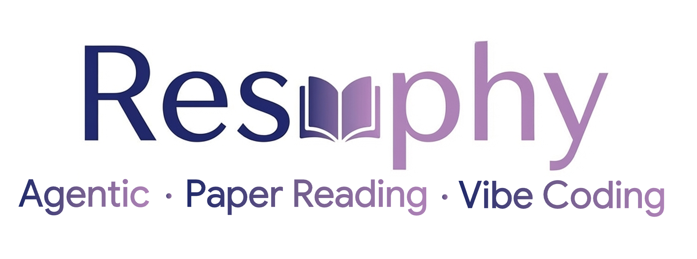
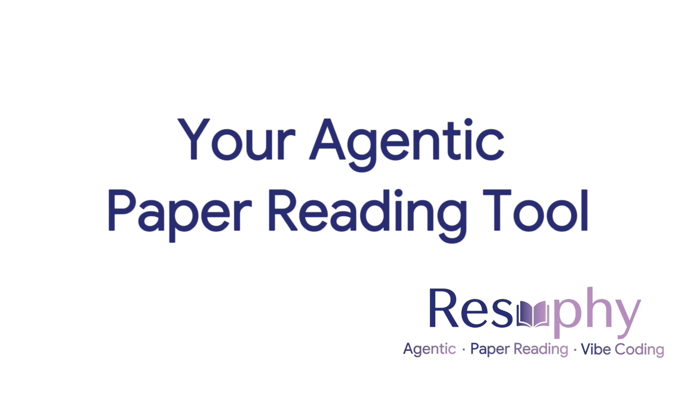
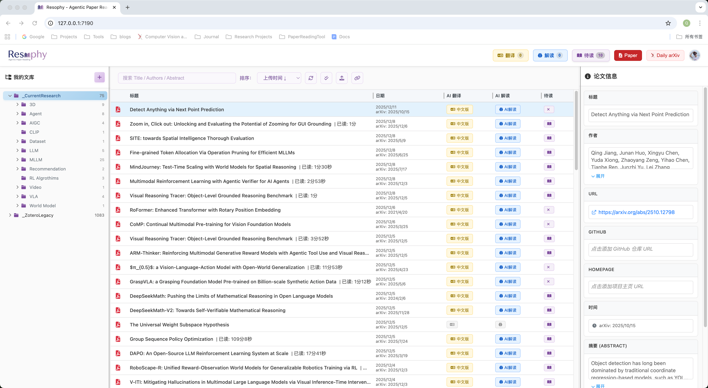

<div align="center" xmlns="http://www.w3.org/1999/html">
<!-- logo -->
<p align="center">
  
</p>


<!-- language -->

[English](README.md) | [简体中文](docs/README_en.md)

</div>
----


[](https://github.com/user-attachments/assets/25f15670-1259-4e87-88a9-2648dcd78272)

----

在 AI 快速发展的时代，科研工作者需要一个**定制化的现代论文阅读器**，加快你对知识的获取。**Resophy** 是一个完全开源、面向 Vibe Coding 的现代论文阅读与管理平台。

- **Vibe Coding Oriented**：Resophy 所有功能都通过 Cursor + Claude Sonnet 4.5 实现，采用简单的技术栈（HTML + JavaScript + Python Flask），你可以随时通过 Vibe Coding 的方式修改源码，添加自己需要的功能，打造专属的论文阅读工具

#### 核心功能

- 🤖 **AI 自动 PDF 翻译**：一键将英文论文翻译为中文，生成双语对照版本
- 🧠 **AI 解读生成**：深度分析论文内容，生成结构化解读报告
- 📰 **自动爬取 arXiv 论文**：定时获取最新 arXiv 论文，智能过滤，快速找到你感兴趣的研究
- ⚡ **提升阅读效率**：结合 AI 解读和翻译，大幅提升每日论文阅读量
- 📚 **文献管理**：树形分类、全文搜索、元数据管理
- 📥 **简易导入导出**：支持导入 Zotero 文献，实现无缝迁移，同时 Resophy 的数据可以轻松导出进行多平台迁移


## 目录

- [](#)
    - [核心功能](#核心功能)
- [目录](#目录)
- [1. 安装](#1-安装)
- [2. 快速上手](#2-快速上手)
  - [2.1 ⚙️ 初始配置](#21-️-初始配置)
    - [📥 从 Zotero 导入论文](#-从-zotero-导入论文)
    - [🤖 配置 LLM API](#-配置-llm-api)
    - [🔧 配置 MinerU API（用于 AI 解读）](#-配置-mineru-api用于-ai-解读)
  - [2.2. 🚀 主要功能使用](#22--主要功能使用)
    - [📚 论文管理](#-论文管理)
    - [🌐 AI 翻译](#-ai-翻译)
    - [🧠 AI 解读](#-ai-解读)
    - [📰 Daily arXiv](#-daily-arxiv)
    - [📊 其他功能](#-其他功能)
- [3. 💻 Vibe Coding](#3--vibe-coding)
  - [🚀 开始 Vibe Coding](#-开始-vibe-coding)
  - [📁 项目结构](#-项目结构)
  - [💡 示例：添加新功能](#-示例添加新功能)
- [4. LICENSE](#4-license)

## 1. 安装
Resophy 采用前后端分离的架构：

1. **主服务（Resophy Core）**：Flask 后端服务，提供论文管理、分类、搜索等核心功能
   - 代码位置：项目根目录的 `app.py`, `routes/`, `core/`, `tools/` 目录
   - 前端代码：`templates/` 和 `static/` 目录

2. **LLM 服务器**：用于 AI 翻译、解读和 arXiv 论文分析的 LLM 推理服务（可选，支持本地部署或远程 API）
   - 支持使用 `lmdeploy` 或 `vllm` 框架部署本地模型

3. **MinerU 服务器**：用于 PDF 到 Markdown 解析的文档解析服务（可选，用于 AI 功能）
   - 使用 MinerU2.5 模型进行高精度文档解析
  
Resophy 使用 `uv` 进行依赖管理，支持分离部署架构。你可以将 Resophy 主服务和 AI 服务器部署在不同的机器上。安装和配置说明，请参考 [安装文档](docs/installation_zh.md)


## 2. 快速上手

<div align=center>
  
</div>


### 2.1 ⚙️ 初始配置

#### 📥 从 Zotero 导入论文

1. 在 Zotero 中导出你的文献库：
   - 选择要导出的文献
   - 右键 → "导出条目" → 选择 "RDF" 格式
   - 保存为 `.rdf` 文件

2. 在 Resophy 中导入：
   - 点击头像进入设置界面，点击 "Import" 按钮
   - 选择导出的 `.rdf` 文件
   - 系统会自动解析并导入论文元数据和 PDF 文件

#### 🤖 配置 LLM API

1. 点击头像进入设置界面
2. 找到 "Agentic" 部分
3. 配置 LLM API：
   - **本地部署**：输入本地 LLM 服务器地址（如 `http://0.0.0.0:6002/v1`）
   - **远程 API**：输入 API 地址和密钥（如 OpenAI、DeepSeek 等）
4. 保存设置

#### 🔧 配置 MinerU API（用于 AI 解读）

1. 点击头像进入设置界面
2. 找到 "Agentic" 部分
3. 输入 MinerU 服务器地址（如 `http://0.0.0.0:6001`）
3. 保存设置


### 2.2. 🚀 主要功能使用

#### 📚 论文管理

- **📤 上传论文**：支持拖拽 PDF 上传，以及输入 arXiv URL 链接直接下载论文
- **📁 分类管理**：使用左侧分类树组织论文，支持创建、重命名、删除分类
- **🔍 搜索功能**：使用顶部搜索框进行全文搜索，支持标题、作者、摘要等

#### 🌐 AI 翻译

1. 在主界面选择一篇论文
2. 点击 "AI 翻译" 按钮
3. 系统会自动：
   - 调用 LLM 进行翻译
   - 生成双语对照 PDF（原版 + 中文翻译）
4. 翻译完成后，可在论文详情页查看翻译结果

#### 🧠 AI 解读

1. 选择一篇论文，点击 "AI 解读" 按钮
2. 系统会启动后台任务：
   - 解析 PDF 为 Markdown（使用 MinerU）
   - 使用 LLM 深度分析论文内容
   - 生成结构化解读报告（包括摘要、方法、实验、结论等）
3. 在 "解读任务" 页面查看进度和日志
4. 解读完成后，点击论文进入解读视图查看详细分析

#### 📰 Daily arXiv

1. **⚙️ 配置筛选条件**：
   - 进入设置 → "Daily arXiv 设置"
   - 设置关键词、作者、机构等筛选条件
   - 配置自动分类规则

2. **📥 获取今日论文**：
   - 点击 "Daily arXiv" 按钮
   - 系统自动爬取今日 arXiv 论文
   - 根据筛选条件过滤论文
   - 显示匹配的论文列表

3. **✅ 批量操作**：
   - 浏览论文列表，勾选感兴趣的论文
   - 点击 "添加到阅读列表" 批量导入
   - 或直接点击论文查看详情

#### 📊 其他功能

- **📈 阅读历史**：自动记录阅读时间，生成阅读热力图
- **💾 导出功能**：支持导出为 JSON 格式，便于数据迁移
- **✏️ 元数据管理**：编辑论文标题、作者、标签等信息


## 3. 💻 Vibe Coding

Resophy 采用简单的技术栈（Python Flask + HTML + JavaScript），所有代码结构清晰，非常适合通过 **Vibe Coding** 的方式进行定制化开发。你可以轻松修改或添加任何你想要的功能。

### 🚀 开始 Vibe Coding

1. **打开项目**
   - 在 [Cursor](https://cursor.sh/) 或 [GitHub Copilot](https://github.com/features/copilot) 等 AI 编程工具中打开 Resophy 项目

2. **理解项目结构**
   - 首先向 AI 发送以下 prompt：
   ```
   请理解当前这个论文阅读平台的功能
   ```
   - AI 会自动分析项目结构，理解各个模块的功能

3. **实现你的想法**
   - 之后你可以直接向 AI 描述任何你想实现的功能，例如：
   - "添加一个论文收藏功能"
   - "修改翻译功能，支持更多语言"
   - "添加论文引用关系可视化"
   - "实现论文自动分类功能"
   - 等等...

### 📁 项目结构

```
Resophy/
├── app.py                 # Flask 应用入口
├── core/                  # 核心功能模块
│   ├── base_paper.py      # 论文数据模型
│   ├── paper_store.py     # 论文存储管理
│   └── search_index.py     # 全文搜索索引
├── routes/                # 路由模块
│   ├── agent_routes/      # AI 功能路由（翻译、解读）
│   └── basic_routes/      # 基础功能路由（分类、搜索、导入导出等）
├── tools/                 # 工具函数
│   ├── agent_tools/       # AI 工具（翻译、解读实现）
│   └── basic_tools/       # 基础工具（PDF 处理、arXiv 爬取等）
├── templates/             # HTML 模板
├── static/                # 静态资源（CSS、JavaScript、图片）
└── docs/                  # 文档
```

### 💡 示例：添加新功能

假设你想添加一个"论文评分"功能：

1. **向 AI 描述需求**：
   ```
   我想添加一个论文评分功能，用户可以对每篇论文打 1-5 星，评分数据保存在论文的 JSON 元数据中，并在论文列表中显示评分。
   ```

2. **AI 会自动帮你**：
   - 修改数据模型（`core/base_paper.py`）
   - 添加前端界面（`templates/` 和 `static/`）
   - 创建后端 API（`routes/basic_routes/`）
   - 更新相关功能

3. **测试和迭代**：
   - 运行项目测试新功能
   - 根据需求继续与 AI 对话优化功能

通过 Vibe Coding，你可以将 Resophy 打造成完全符合你个人需求的论文阅读工具！🎉


## 4. LICENSE
Resophy 采用 [CC BY-NC 4.0](https://creativecommons.org/licenses/by-nc-sa/4.0/deed.en) 开源许可证，请参考 [LICENSE](LICENSE) 文件。