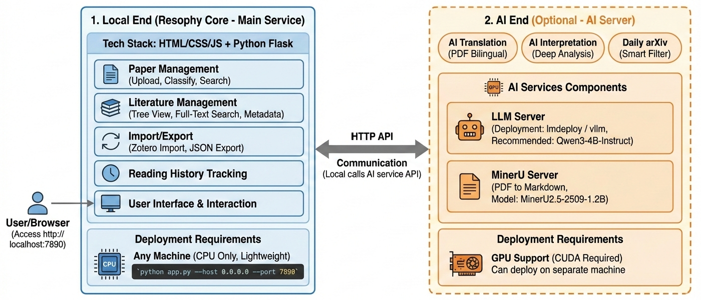
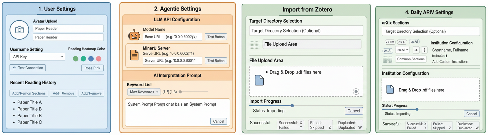

<!-- logo -->

  

  <!-- Stars Badge -->
  

  <!-- Forks Badge -->
  

  <!-- Open Issues Badge -->
  

  <!-- Issue Resolution Badge -->
  

  <!-- Pull Requests Badge -->
  

  <!-- Platform Support Badge (Windows, Mac, Linux) with Light Green -->
  

  <!-- UV Installation Badge (Custom) -->
  

  

[English](README.md) | [简体中文](docs/README_en.md) | [安装文档](docs/installation_zh.md) | [快速开始](docs/quick_start_zh.md)

***Resophy 所有代码和文档都通过 AI 生成，人工校验 |***
***Code：Cusor + Sonnet 4.5 / Opus 4.5 / Auto |***
***README: Cusor, Nano Banana Pro, NotebookLM, GPT5.1***

----

----

# Resophy

在如今信息爆炸的时代，科研人员面对海量的论文，常常感到疲惫不堪。如何快速获取精华、理解前沿成果，成了每个研究者的痛点。Resophy 诞生的初衷就是要让你告别低效的论文阅读，赋能科研者，让读论文变得更高效、更智能📚⚡。

Resophy 是一个完全开源、Vibe Coding 导向的现代论文阅读器，它通过简洁的技术栈（HTML + JavaScript + Python Flask）和 AI 功能，帮助你快速理解论文的核心内容🤖💡。从自动翻译到论文解析，从智能推荐到一键导入 Zotero，Resophy 一站式解决你的论文阅读需求📑✨。最重要的是，你可以随时通过 **Vibe Coding** 的方式自定义功能，打造成专属于你的论文助手🎨🛠️。

#### 🚀 核心功能

<!-- logo -->

  

----

## 目录

- [Resophy](#resophy)
      - [核心功能](#核心功能)
  - [目录](#目录)
  - [1. 安装](#1-安装)
  - [2. 快速上手](#2-快速上手)
    - [2.1 ⚙️ 初始配置](#21-️-初始配置)
      - [📥 从 Zotero 导入论文](#-从-zotero-导入论文)
      - [🤖 配置 LLM API](#-配置-llm-api)
      - [🔧 配置 MinerU API（用于 AI 解读）](#-配置-mineru-api用于-ai-解读)
    - [2.2. 🚀 主要功能使用](#22--主要功能使用)
      - [📚 论文管理](#-论文管理)
      - [🌐 AI 翻译](#-ai-翻译)
      - [🧠 AI 解读](#-ai-解读)
      - [📰 Daily arXiv](#-daily-arxiv)
      - [📊 其他功能](#-其他功能)
  - [3. 💻 Vibe Coding](#3--vibe-coding)
    - [🚀 开始 Vibe Coding](#-开始-vibe-coding)
    - [📁 项目结构](#-项目结构)
    - [💡 示例：添加新功能](#-示例添加新功能)
  - [4. LICENSE](#4-license)

## 1. 安装

  
  

    Resophy 采用前后端分离的架构
  

1. **主服务（Resophy Core）**：HTML + JavaScript + Python Flask 后端服务，提供论文管理、分类、搜索等核心功能
2. **AI 服务** 包括：
   - **LLM 服务器**：用于 AI 翻译、解读和 arXiv 论文分析的 LLM 推理服务（可选，支持本地部署或远程 API）
   - **MinerU 服务器**：用于 PDF 到 Markdown 解析的文档解析服务（可选，用于 AI 功能）
  
Resophy 使用 `uv` 进行依赖管理，支持分离部署架构。你可以将 Resophy 主服务和 AI 服务器部署在不同的机器上。安装和配置说明，请参考：

  <table>
    <thead>
      <tr>
        <th>系统</th>
        <th>文档</th>
      </tr>
    </thead>
    <tbody>
      <tr>
        <td>Windows / Mac / Linux</td>
        <td><a href="docs/installation_zh.md">安装文档</a></td>
      </tr>
    </tbody>
  </table>

## 2. 快速上手

在这一节，我们简要介绍一些 Resophy 的使用方法

### 2.1 ⚙️ 第一步，进行初始配置

  
  

    第一步，设置参数以及从 Zotero 进行论文迁移
  

| 配置模块 | 位置 | 主要功能 | 使用方法 |
|---------|------|---------|---------|
| **📸 用户设置** | 设置界面 → "User" 标签页 | • 头像上传 • 用户名设置 • 阅读热力图颜色主题 • 最近阅读记录 | 1. 点击界面右上角头像 2. 进入 "User" 标签页 3. 上传头像、设置用户名、选择颜色 4. 设置自动保存 |
| **🤖 Agentic 设置** | 设置界面 → "Agentic" 标签页 | • LLM API 配置（模型名、URL、密钥） • MinerU 服务器配置 • AI 解读提示词自定义 | 1. 进入 "Agentic" 标签页 2. 配置 LLM API 和 MinerU 地址 3. （可选）自定义提示词 4. 测试连接并保存 |
| **📰 Daily arXiv** | 设置界面 → "Daily arXiv" 标签页 | • arXiv 分区配置（cs.CV、cs.AI 等） • 抓取设置（保留天数、检查间隔） • 关键词列表（用于智能分类） • 机构配置 | 1. 进入 "Daily arXiv" 标签页 2. 添加 arXiv 分区 3. 配置抓取参数和关键词 4. （可选）添加自定义机构 5. 保存设置 |
| **📥 Zotero 导入** | 设置界面 → "Import" 标签页 | • 目标目录选择 • RDF 文件拖拽上传 • 导入进度显示 • 导入结果统计 | 1. 在 Zotero 中导出为 RDF 格式 2. 进入 "Import" 标签页 3. （可选）选择目标目录 4. 拖拽 RDF 文件上传 5. 查看导入进度和结果 |

<strong>展开详细介绍</strong>

#### 📸 用户设置（User Settings）

**功能详情**：
- **头像上传**：点击头像区域上传自定义头像，支持预览和裁剪
- **用户名设置**：输入用户名（默认：Paper Reader）
- **阅读热力图颜色**：选择颜色主题（绿色/蓝色/玫瑰粉），用于可视化每日阅读时间
- **最近阅读记录**：显示最近阅读的论文列表，快速访问历史记录

#### 🤖 Agentic 设置（AI 功能配置）

**功能详情**：
- **LLM API 配置**：
  - Model Name：输入模型名称（如：`Qwen3-4B-Instruct-2507`）
  - Base URL：输入 API 地址（本地：`http://0.0.0.0:6002/v1` 或远程 API）
  - API Key：输入访问密钥
  - 测试按钮：验证 API 连接
- **MinerU 服务器配置**：输入服务器地址（如：`http://0.0.0.0:6001`），用于 PDF 解析
- **AI 解读提示词**：大型文本编辑器，可自定义 System Prompt，控制 AI 解读生成风格

**用途**：统一的 AI 功能配置，用于翻译、解读、Daily arXiv 等所有 AI 功能

#### 📰 Daily arXiv 设置

**功能详情**：
- **arXiv 分区配置**：添加/删除分区标签（cs.CV、cs.AI 等），提供常用分区快捷按钮
- **抓取设置**：论文保留天数（1-30 天）、检查间隔（5-60 分钟）
- **关键词列表**：添加关键词标签，设置最多关键词数（1-3），用于 AI 自动分类
- **机构配置**：添加自定义机构，支持编辑缩写和全称变体

#### 📥 从 Zotero 导入

**功能详情**：
- **目标目录选择**：下拉菜单选择导入位置（可选，默认根目录）
- **文件上传区域**：大型拖拽上传区，支持拖拽 `.rdf` 文件
- **导入进度显示**：进度条、状态文本、取消按钮
- **导入结果统计**：成功/失败/跳过/重复数量

**使用步骤**：
1. 在 Zotero 中导出文献库为 RDF 格式
2. 在 Resophy 设置界面进入 "Import" 标签页
3. （可选）选择目标目录
4. 拖拽 RDF 文件到上传区域
5. 系统自动解析并导入论文，显示导入进度和结果

### 2.2 基本操作

<strong>查看基本操作</strong>

| 操作模块 | 主要功能 | 使用方法 |
|---------|---------|---------|
| **📚 论文管理** | • 上传论文（拖拽 PDF 或输入 arXiv URL） • 分类管理（创建/重命名/删除分类，移动论文） • 全文搜索（标题、作者、摘要） | 1. 拖拽 PDF 到上传区域或输入 arXiv URL 2. 左侧分类树管理分类结构 3. 顶部搜索框进行全文搜索 |
| **📖 论文查看** | • 查看论文详情 • PDF 阅读器 • 自动记录阅读时间 | 1. 点击论文卡片进入详情页 2. 查看元数据和摘要 3. 点击 "查看 PDF" 打开阅读器 |
| **✏️ 元数据管理** | • 编辑论文信息（标题、作者、摘要等） • 添加备注和标签 • 管理 BibTeX 引用 • 设置链接（GitHub、主页） | 1. 进入论文详情页 2. 点击 "编辑" 按钮 3. 修改信息并保存 |
| **📈 阅读历史** | • 自动记录阅读时间 • 阅读热力图（可视化每日阅读统计） • 最近阅读记录 | 在用户设置中查看阅读热力图和最近阅读列表 |
| **📥 导出功能** | • 导出论文库为 JSON 格式 • 包含元数据和分类结构 | 1. 进入设置界面 2. 选择导出范围 3. 下载 JSON 文件 |

**📝 论文元数据自动获取**：

当上传论文时（通过 arXiv URL 或拖拽 PDF），系统会自动获取论文元数据：

1. **通过 arXiv API 获取基本信息**：
   - 调用 arXiv API 获取论文的标题（title）、作者（authors）、摘要（abstract）、年份（year）等信息
   - 下载 PDF 文件

2. **通过 DBLP API 获取 BibTeX**：
   - 使用论文标题和作者信息调用 DBLP API
   - 尝试获取更准确的 BibTeX 引用格式
   - 如果 DBLP 获取成功，则使用 DBLP 的 BibTeX；否则使用 arXiv 的 BibTeX

3. **拖拽上传 PDF 的处理流程**：
   - 系统会尝试从文件名或 PDF 元数据中提取 arXiv ID
   - 如果找到 arXiv ID，则调用 arXiv API 获取信息
   - 后台异步调用 DBLP API 更新 BibTeX
  

### 2.3. AI 翻译

<strong>查看 AI 翻译</strong>

**实现方式**：

Resophy 的 AI 翻译功能使用 [Babeldoc](https://github.com/funstory-ai/BabelDOC) 工具实现 PDF 双语翻译：

1. **调用 babeldoc**：
   - 传入配置的 LLM API 信息（模型、URL、密钥）

2. **翻译流程**：
   - babeldoc 读取原始 PDF 文件
   - 调用 LLM API 进行翻译（支持 OpenAI 兼容接口）
   - 生成双语对照 PDF（`.zh.dual.pdf`），原版和中文翻译并排显示

**使用方法**：
1. 在主界面选择一篇论文
2. 点击 "AI 翻译" 按钮
3. 系统后台执行翻译任务
4. 翻译完成后可在论文详情页查看双语 PDF

### 2.4 AI 解读

<strong>查看 AI 解读</strong>

**实现方式**：

Resophy 的 AI 解读功能采用两步流程，深度分析论文内容：

1. **PDF 解析为 Markdown**：
   - 使用 [MinerU](https://github.com/opendatalab/MinerU) 工具将 PDF 解析为结构化 Markdown
   - 连接到配置的 MinerU 服务器（支持 vLLM 部署）
   - 保留图片、表格等元素，生成高质量的 Markdown 文档

2. **LLM 深度解读**：
   - 使用 `openai` 库调用 LLM API（支持 OpenAI 兼容接口）
   - 将 Markdown 内容作为输入，结合自定义 System Prompt
   - LLM 生成结构化解读报告（摘要、方法、实验、结论等）
   - 支持自定义提示词，控制解读风格和内容格式

**使用方法**：
1. 选择一篇论文，点击 "AI 解读" 按钮
2. 系统启动后台任务：
   - 第一步：MinerU 解析 PDF 为 Markdown
   - 第二步：LLM 深度分析并生成解读报告
3. 在 "解读任务" 页面查看进度和日志
4. 解读完成后，点击论文进入解读视图查看详细分析

### 2.5. Daily arXiv

<strong>查看 Daily arXiv 功能</strong>

**实现方式**：

Daily arXiv 功能自动爬取最新 arXiv 论文，并使用 AI 进行智能分析和筛选：

1. **论文爬取**：
   - 使用 `arxiv` Python 库爬取指定分区的论文
   - 支持定时自动检查（可配置检查间隔）
   - 按日期和分区组织论文

2. **AI 功能应用**：

   **a. 机构信息提取**：
   - 使用 `openai` 库调用 LLM API
   - 从 PDF 第一页文本中提取机构名称（affiliations）
   - 提取机构所在国家（countries）
   - 提取项目主页（homepage）和 GitHub 仓库 URL
   - 支持机构名称标准化和缩写识别

   **b. 摘要总结和关键词提取**：
   - 使用 `openai` 库调用 LLM API
   - 从论文英文摘要生成中文总结（100-200 字）
   - 从预设关键词列表中选择最能代表论文类型的关键词（1-3 个）
   - 关键词用于后续的智能筛选和分类

3. **智能筛选**：
   - 根据配置的关键词列表筛选论文
   - 根据机构信息筛选论文
   - 支持自定义机构映射和标准化

4. **后台任务**：
   - 定时自动检查新论文（可配置间隔）
   - 后台下载 PDF 文件
   - 异步执行 AI 分析任务
   - 自动清理过期论文（可配置保留天数）

**使用方法**：
1. 在设置中配置 arXiv 分区（如 cs.CV、cs.AI）
2. 设置关键词列表和筛选条件
3. 点击 "Daily arXiv" 按钮获取今日论文
4. 系统自动爬取、下载、分析论文
5. 浏览匹配的论文列表，批量导入到阅读列表

## 3. Vibe Coding
## 4. LICENSE
Resophy 采用 [CC BY-NC 4.0](https://creativecommons.org/licenses/by-nc-sa/4.0/deed.en) 开源许可证，请参考 [LICENSE](LICENSE) 文件。